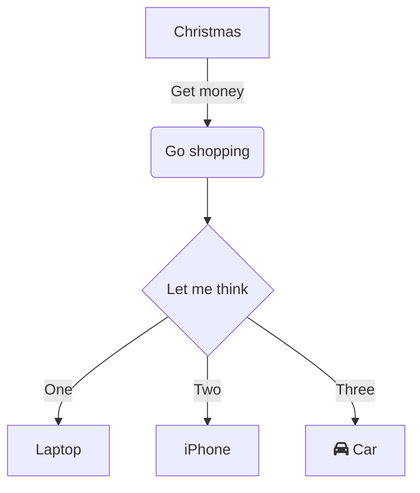

# Doxygen Mermaid

Using Mermaid.js with Doxygen

## Fenced code blocks
Unfortunately mermaid diagrams in fenced code blocks don't work, in both Doxygen comments, nor in
markdown files.



This is because the code blocks generate HTML like the following
```html
<div class="fragment"><div class="line">flowchart TD</div>
<div class="line">    A[Christmas] --&gt;|Get money| B(Go shopping)</div>
<div class="line">    B --&gt; C{Let me think}</div>
<div class="line">    C --&gt;|One| D[Laptop]</div>
<div class="line">    C --&gt;|Two| E[iPhone]</div>
<div class="line">    C --&gt;|Three| F[fa:fa-car Car]</div>
</div><!-- fragment -->
```
which could _maybe_ be post-processed by JavaScript using a technique like
<https://github.com/martysama0134/doxygen-with-highlightjs>, except that there's nothing to indicate
what language the code block is.

## Mermaid tags

Instead, wrap the mermaid diagram in `mermaid/endmermaid` tags.

```
//! @mermaid
//! flowchart TD
//!     A[Christmas] -->|Get money| B(Go shopping)
//!     B --> C{Let me think}
//!     C -->|One| D[Laptop]
//!     C -->|Two| E[iPhone]
//!     C -->|Three| F[fa:fa-car Car]
//! @endmermaid
```

You can also use the `mermaid/endmermaid` tags in a markdown file, but that won't render correctly
in Git forges like GitHub and GitLab.

## How's it work?

Add the following to your `docs/Doxyfile`
```
ALIASES     += mermaid="<pre class=\"mermaid\">"
ALIASES     += endmermaid="<\pre>"
```

Then, add

```html
<script src="https://cdn.jsdelivr.net/npm/mermaid/dist/mermaid.min.js"></script>
```
to the HTML header, and

```html
<script>
    mermaid.init({ startOnLoad: true, theme: "default" });
</script>
```

to the HTML footer.

Do so by generating the default HTML template with

```sh
doxygen -w html docs/header.html docs/footer.html docs/stylesheet.css docs/Doxyfile
# We don't need the stylesheet
rm docs/stylesheet.css
```

then edit the generated `header.html` and `footer.html` and add
```
HTML_HEADER     = docs/header.html
HTML_FOOTER     = docs/footer.html
```
to your `docs/Doxyfile`.

## Other approaches

* https://github.com/martysama0134/doxygen-with-highlightjs -- custom code block highlighting with
  `highlight.js` (for inspiration)
* https://github.com/tttapa/doxygen-mermaid -- requires saving mermaid diagrams to standalone files
* https://github.com/doxygen/doxygen/pull/8684 -- a stale GitHub PR adding support for Mermaid.js by
  invoking the mermaid CLI tool
